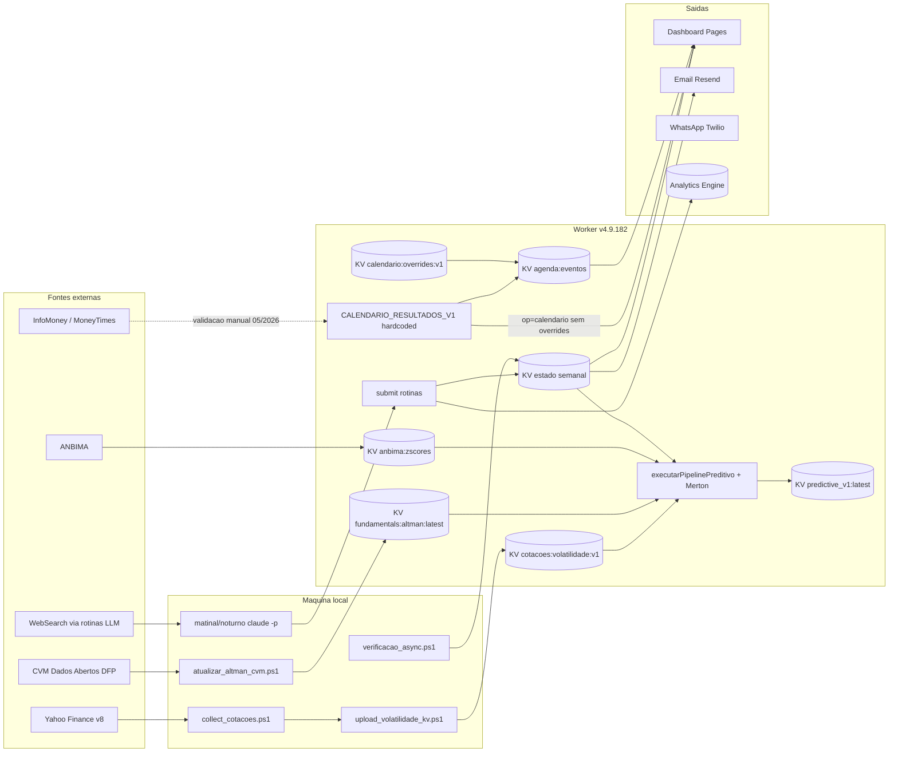

# 01 — Mapa de Fluxo de Dados VIX Radar

Data: 2026-07-28. Base: SHA `fdae5cb`, bundle `api/v4.9.182.js`. Achados citados por ID, registro canônico em `00-AUDITORIA-SISTEMA-COMPLETA.md`.

Objetivo: rastrear cada dado do sistema da origem à exibição, marcando onde a proveniência existe e onde se perde. A legenda de cada fluxo aponta os achados que nascem nele.

## Visão geral

## Fluxo 1 — Eventos de crédito (núcleo do produto)

| Etapa | Onde | Proveniência |
|---|---|---|
| Origem | WebSearch executado pelos lotes `claude -p` das rotinas matinal (10h) e noturna (18h) | `fontes_consultadas[]` por emissor, exigido pelo protocolo |
| Transporte | Script PowerShell submete ao Worker com `ROUTINE_API_KEY` | Contador `buscas` é autodeclarado pelo modelo (OPS-001) |
| Armazenamento | KV estado semanal, leitura multi-semana (`carregarEstadoMultiSemana`, 5 semanas) | `sem_eventos` exige `cobertura_nota`, INCONCLUSIVO preserva estado anterior |
| Verificação | Fila adversarial assíncrona (dreno local), retratação via `retratarEventoRejeitado` | Foi a única camada que percebeu o incidente de 27/07 |
| Exibição | `op=state`, `op=ews`, briefing executivo, e-mail | — |

Ponto forte: este é o fluxo com melhor disciplina de proveniência do sistema (fontes por rodada, verificador, retratação). Ponto fraco: a saúde da rotina que o alimenta é medida por autodeclaração (OPS-001, OPS-003).

## Fluxo 2 — Cotações e volatilidade

Cadeia: Yahoo Finance v8 (`query1.finance.yahoo.com`) → `collect_cotacoes.ps1` (17h00, Task Scheduler) → `data/cotacoes/series/*.json` + `meta_volatilidade.json` → `upload_volatilidade_kv.ps1` → KV `cotacoes:volatilidade:v1` (TTL 24h) → `executarPipelinePreditivo` → Merton DD → `predictive_v1:latest` → `op=predictive_v1` (lab interno, auth admin).

| Ponto de perda | Achado |
|---|---|
| Orquestrador engole falha do coletor filho, exit 2 de cobertura baixa nunca lido | OPS-002 |
| `market_cap` no payload carrega preço por ação, guarda de consumo `> 100` invertida | VOL-001 |
| Estimador de volatilidade (RMS não centralizado) sem contrato | VOL-002 |
| `selic_anual` constante 0.1375 sem `as_of`, fallback duplicado no bundle | VOL-003, DEC-001 |
| Cobertura real 73/103 (21 falhas de fetch em 27/07) sem alerta | OPS-002 |

Frescor: TTL de 24h no KV significa que dois dias de coleta falhada apagam a chave inteira e o Merton para em silêncio (o pipeline tolera `volatilidadeKV` nulo, mas ninguém é avisado da degradação).

## Fluxo 3 — Fundamentals CVM (Altman)

Cadeia: CVM Dados Abertos, DFP 2025 consolidado → `scripts/predictive/atualizar_altman_cvm.ps1` (execução semanal ou sob demanda, pré-requisito declarado da rotina de volatilidade) → KV `fundamentals:altman:latest` → pipeline preditivo (Z''-EM, dívidas para o Merton).

Proveniência: boa na origem (`fonte`, `gerado_em`, `dt_refer: 2025-12-31` por empresa, `aproximacoes[]`). Limitações: dado anual (defasagem estrutural de até 12 meses), sem `market_cap` (o que empurra o Merton para patrimônio líquido contábil, VOL-001), atualização manual sem monitoramento de staleness.

## Fluxo 4 — Calendário de resultados

Cadeia dupla, e é aqui que o fluxo trai o usuário:

1. Base hardcoded `CALENDARIO_RESULTADOS_V1` no bundle (20 emissores, validada por última vez em 2026-05-09 contra InfoMoney/MoneyTimes) (CAL-004).
2. Overrides em KV `calendario:overrides:v1`, escritos por endpoint admin, com rebuild automático da agenda.
3. Leitura A: `agendaBuildPersistir` mescla base + overrides e gera `agenda:eventos`, mas descarta `status` e `nota` de cada trimestre (CAL-001).
4. Leitura B: `op=calendario` usa `obterCalendarioEmpresa`, que lê só a base hardcoded e ignora overrides (CAL-003). O frontend transforma qualquer status não-"divulgado" em selo AGENDADO (CAL-001).

Resultado: a única camada que sabe que a data é estimativa é a que ninguém vê. E o fluxo já entregou dado errado: em 28/07 as duas datas checadas contra fonte oficial divergiam (Bradesco 05/08 e não 28/07, Vale 30/07 e não 24/07), o que faz de CAL-002 o P0 ativo do registro.

## Fluxo 5 — ANBIMA (z-scores, spreads, liquidez)

KV `anbima:zscores` consumido pelo pipeline (spread relativo setorial, liquidez). A rotina produtora não foi rastreada nesta sessão, origem marcada como lacuna no relatório 00 (seção 7). O parse ANBIMA no bundle carrega `desvio_padrao` próprio da fonte.

## Fluxo 6 — Canais de saída e telemetria

| Canal | Prova de entrega | Achado |
|---|---|---|
| Dashboard (Pages) | n/a | CAL-001 no selo, CAL-002 no dado exibido |
| E-mail (Resend) | `resend:true` no health, erro lança exceção | SEC-001 (resolvido) |
| WhatsApp (Twilio) | Nenhuma. HTTP 201 é aceite, não entrega, sem StatusCallback | SEC-003 |
| Telemetria (Analytics Engine `RADAR_USAGE_EVENTS`) | `telemetria:true` no health | Foi quem preservou a evidência de SEC-001 |

## Fluxo 7 — Vigilância externa (GitHub Actions)

`frescor-check.yml` (22h37 BRT) e `scan-emergencia.yml` (20h30 BRT) leem `admin_health_check` com `secrets.ADMIN_PASSWORD`. Secret ausente encerra verde nos dois (CI-001); `ok:false` encerra verde no scan (CI-002). A rotação de secrets tem três destinos (Cloudflare, GitHub, e-mail admin) e verificação ainda parcial (CI-003).

## Onde a proveniência existe e onde falta

| Dado | fonte | as_of | Nível de confiança gravado |
|---|---|---|---|
| Evento de crédito | Sim (`fontes_consultadas`) | Sim (semana) | Sim (tier, verificador) |
| Cotação/volatilidade | Implícita (Yahoo) | `fetched_at`/`gerado_em` global | Não |
| `market_cap` | Não (e o conteúdo não é market cap) | Não | Não |
| SELIC | Não | Não | Não |
| Fundamentals | Sim | Sim (`dt_refer`) | Parcial (`aproximacoes`) |
| Calendário base | Sim (secundária) e extrapolação sem fonte no 2T26 | Sim (global, 2026-05-09) | Sim na origem (`status`), perdido na exibição, e o valor já se provou errado (CAL-002) |
| Entrega WhatsApp | n/a | n/a | Falso (201 = aceite) |

Esta tabela é a materialização de DATA-001: os fluxos onde `fonte`, `as_of` e confiança existem de ponta a ponta são exatamente os que não geraram achado.
